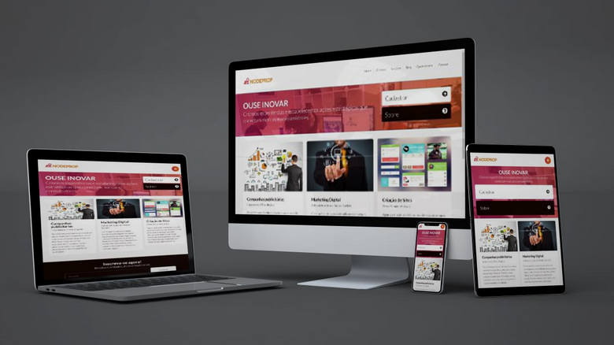

# NodeProp - Soluções Digitais

> Projeto de design responsivo aplicando o conceito de Mobile First utilizando CSS3 puro (sem framework) e consumindo biblioteca o JQuery para exibir e ocultar o menu mobile.

  

