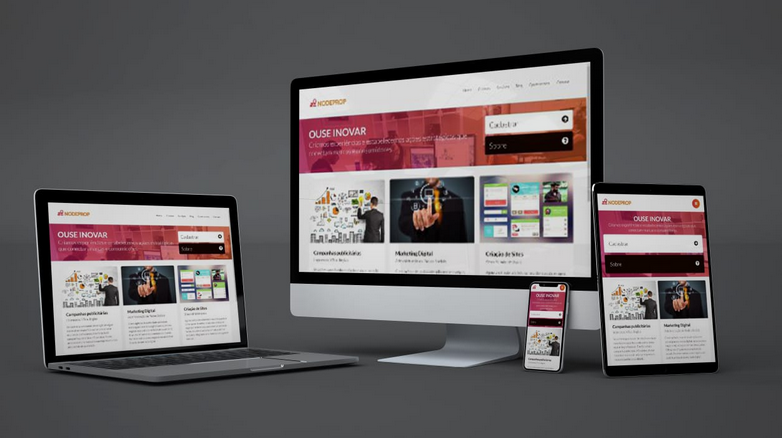

# NodeProp - Soluções Digitais

> Projeto de design responsivo aplicando o conceito de Mobile First utilizando CSS3 puro (sem framework) e consumindo biblioteca o JQuery para exibir e ocultar o menu mobile.

  

 <!-- Não funciona no escopo acima, por isso tem seu próprio  -->
  Front de uma agencia especializada em marketing digital, criação de sites e aplicativos mobile.

## Menu mobile

## Agradecimento

À [Lily Design]() pela confecção do mockup expositivo utilizado no início deste documento.